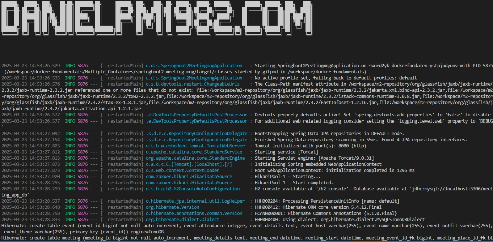
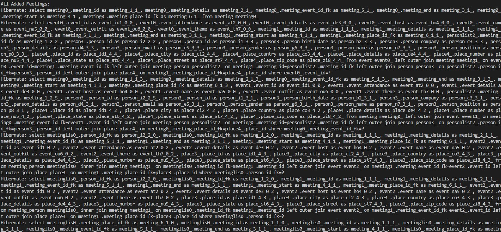

# Multiple Containers

## Docker images
docker images

## Docker containers

docker ps -a

```bash
docker run -d --name meeting-app-mysql \
  -p 3306:3306 \
  -p 33060:33060 \
  -v ./mysql-data:/var/lib/mysql \
  -e MYSQL_ROOT_PASSWORD=root \
  mysql:8
```

### Let me explain what each part of the command does:

- `docker run`: Runs a new Docker container.
- `-d:` Detaches the container, running it in the background.
- `--name` meeting-app-mysql: Names the container "meeting-app-mysql".
- `-p` 3306:3306 and -p 33060:33060: Maps ports 3306 and 33060 on the host machine to the same ports in the container.
- `-v` /tmp/mysql-data:/var/lib/mysql: Maps the local folder /tmp/mysql-data to the /var/lib/mysql directory in the container.
- `-e` MYSQL_ROOT_PASSWORD=root: Sets the MYSQL_ROOT_PASSWORD environment variable to "root".
- `mysql:8`: Uses the official MySQL 8 image

**Docker images**


**Docker Container**


## Attach a bash shell 

- To attach a bash shell to the running container, you can use the

```bash
docker exec -it meeting-app-mysql bash
```

- `docker exec`: Runs a new command inside the running container.
- `-i`: Keeps the standard input (STDIN) open, allowing you to interact with the container.
- `-t`: Allocates a pseudo-TTY, providing a more interactive shell experience.
- `meeting-app-mysql`: Specifies the name of the container to attach to.
- `bash`: Specifies the command to run inside the container (in this case, the bash shell).

```bash
gitpod /workspace/docker-fundamentals/Multiple_Containers (master) $ docker exec -it meeting-app-mysql bash
bash-5.1# 
```

## MYSQL

**Login**

Once you're inside the container, you can run commands like mysql -uroot -p to access the MySQL database, or <br>
explore the file system using ls, cd, etc.

`mysql -uroot -proot`
- show databases;
- use mysql;
- select Host, User from user;

### Create a Database

```sql
CREATE DATABASE meeting_app_db;
```
- This will create a new database named meeting_app_db inside the MySQL instance running in the container.

***To verify,***

- SHOW DATABASES;


**Create a user identified by admin and GRANT ALL PRIVILEGES**

- This will create a new user named `sword2yk_user` with the password admin. The '%' specifies that the user can connect from any host.
- This will grant the `sword2yk_user` user all privileges (SELECT, INSERT, UPDATE, DELETE, etc.) on the meeting_app_db database.

**CREATE**
```sql
CREATE USER 'sword2yk_user'@'%' IDENTIFIED BY 'admin1234';
```

**GRANT**
```sql
GRANT ALL PRIVILEGES ON meeting_app_db.* TO 'sword2yk_user'@'%';
```

**REVOKE**
```sql
REVOKE ALL PRIVILEGES ON meeting_app_db.* FROM 'sword2yk_user'@'%';
```
- This will grant only the SELECT, INSERT, UPDATE, and DELETE privileges on the `meeting_app_db` database to the `sword2yk_user user`.
```sql
GRANT SELECT, INSERT, UPDATE, DELETE ON meeting_app_db.* TO 'sword2yk_user'@'%';
```


**Login to the database with the new user**
- This will log you in to the `meeting_app_db` database as the `sword2yk_user` user with the password `admin`.
- mysql -u sword2yk_user -p- or
- mysql -u sword2yk_user -p meeting_app_db or
- mysql -u sword2yk_user -padmin1234 meeting_app_db
- show databases;

## Clone

git clone -b mysql-db https://github.com/danielpm1982/springboot2-meeting-mng.git

### src/resoures/application.properties
spring.jpa.hibernate.ddl-auto=update
spring.datasource.url=jdbc:mysql://${MYSQL_PORT_3306_TCP_ADDR:localhost}:${MYSQL_PORT_3306_TCP_PORT:3306}/${MYSQL_ENV_MYSQL_DATABASE:meeting_app_db}
spring.datasource.username=${MYSQL_ENV_MYSQL_USER:sword2yk_user}
spring.datasource.password=${MYSQL_ENV_MYSQL_PASSWORD:admin1234}
spring.datasource.driver-class-name =com.mysql.cj.jdbc.Driver
spring.jpa.database-platform=org.hibernate.dialect.MySQL5InnoDBDialect

### Run the app Springboot2MeetingmngApplication 
`/springboot2meetingmng/Springboot2MeetingmngApplication.java`


**Data seeded into the databases mysql `meeting_app_db`**


- Change the `spring.jpa.hibernate.ddl-auto=update` to `spring.jpa.hibernate.ddl-auto=validate` on the application properties after seeding the data first time.
<br>
- `validate` ensures schema consistency without automatic updates, making it ideal for production scenarios where strict control over database changes is necessary.

## Complie the latest `springboot2meetingmg`
AI to support

## Create the application Docker file

- `FROM openjdk:latest`: This line uses the latest version of the OpenJDK image as the base. While using "latest" is convenient, it's often better to specify a specific version for stability, especially in production environments.

- `WORKDIR /`: This sets the working directory in the container to the root directory. It's more common to set it to something like "/app" to keep application files organized.

- `EXPOSE 8080`: This indicates that the application listens on port 8080. However, to make the port accessible outside the container, you need to use the "-p" flag when running the container.

- `COPY ./springboot2-meetingmng-0.0.1-SNAPSHOT.jar /meeting-app.jar`: This copies the specified JAR file from the build context into the container's root directory. Consider copying it to a more specific directory like "/app/".

- `CMD ["jave","-jar","meeting-app.jar"]`: This sets the default command to run the JAR file. There's a typo here—"jave" should be "java". Also, it's good practice to include error handling or logging in the command.

## Build the Docker image file for the app
- Docker build syntax

`docker build -t my-java-app .`
- app image build

`docker build -t meeting-app:v.2.0.0 .`
1:02:26