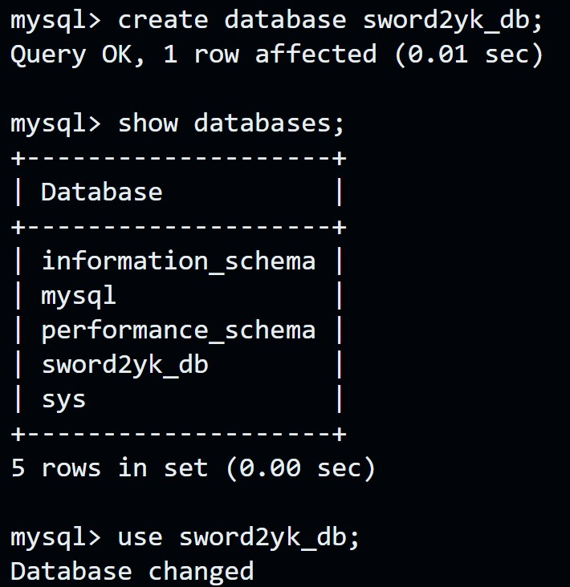
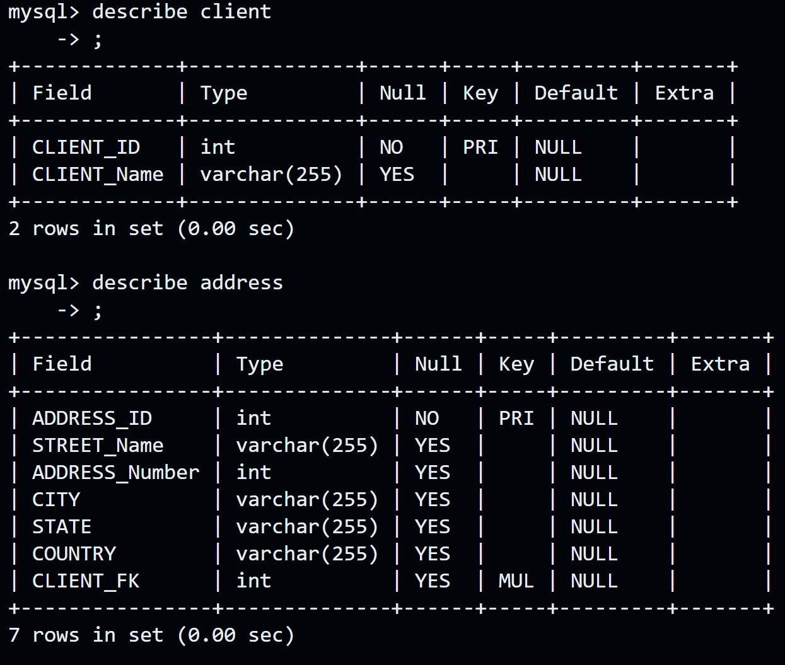
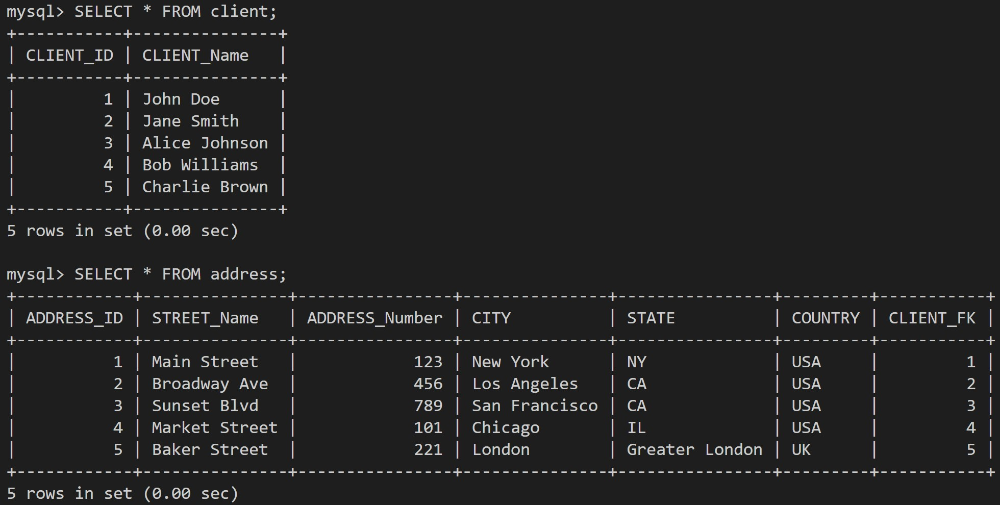
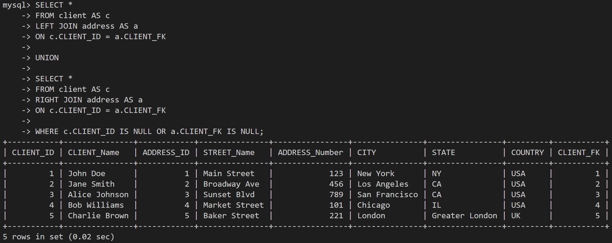
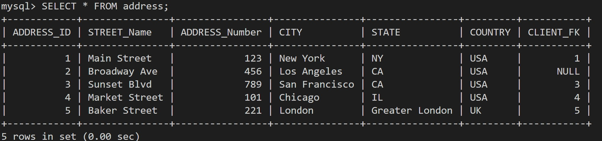

# MYSQL DOCKER CONTAINER

## HUB DOCKER

[Docker Hub](https://hub.docker.com)

On hub docker website search for mysql repositories.<br>
MySQL is a widely used, open-source relational database management system (RDBMS).

**To pull mysql repositories**

```bash
docker pull mysql
```

**Start a mysql server instance**

```bash
$ docker run --name some-mysql -e   MYSQL_ROOT_PASSWORD=my-secret-pw -d mysql:tag```
```
where some-mysql is the name you want to assign to your container, my-secret-pw is the password to be set for the MySQL root user and tag is the tag specifying the MySQL version you want. 

```$ docker exec -it some-mysql bash```

# LAB
Create a folder for sql data ```sql-date```

## Create a MySQL server in a container 

```bash
    docker run --name sword2yk-sql-container -d -p 3306:3306 -p 33060:33060 -v ./sql-data:/var/lib/mysql -e   MYSQL_ROOT_PASSWORD=root mysql:8
```
### **Docker command breakdown step by step**

### **Breakdown:**

| **Option** | **Explanation** |
|------------|---------------|
| `docker run` | Starts a new container from a specified image. |
| `--name sword2yk-sql-container` | The container name `sword2yk-sql-container`. This makes it easier to reference later. |
| `-d` | Runs the container in detached mode (in the background). |
| `-p 3306:3306` | Maps port **3306** inside the container (default MySQL port) to **3306** on the host machine, allowing external access. |
| `-p 33060:33060` | Maps port **33060** inside the container (MySQL X Protocol, used by MySQL Shell and other applications) to **33060** on the host. |
| `-v ./MySQL/sql-data:/var/lib/mysql` | Mounts the local directory `./MySQL/sql-data` to `/var/lib/mysql` inside the container. This ensures MySQL data persists even if the container is removed or restarted. |
| `-e MYSQL_ROOT_PASSWORD=root` | Sets the MySQL root user password to `root`. The `-e` flag defines environment variables inside the container. |
| `mysql:8` | Specifies that the container should use the `mysql` image, version `8`. If not available locally, Docker pulls it from Docker Hub.

1. Creates and runs a MySQL 8 database container in the background.
2. Exposes MySQL on ports 3306 and 33060, making it accessible from the host machine.
3. Persists data in ./MySQL/sql-data to prevent loss when the container stops.
4. Sets the root password for MySQL authentication.

## List all the containers [running, stopped, and exited containers]
```docker ps -a```

```bash
CONTAINER ID   IMAGE        COMMAND                  CREATED        STATUS                     PORTS                     NAMES
a1b2c3d4e5f6   mysql:8      "docker-entrypoint.s…"   3 hours ago   Exited (0) 1 hour ago     3306/tcp, 33060/tcp       sword2yk-sql-container
b2c3d4e5f6g7   nginx        "nginx -g 'daemon of…"   5 hours ago   Up 2 hours                0.0.0.0:8080->80/tcp      my-nginx
```


| **Column**      | **Description** |
| ------------------------------- | --------------------------------------------- |
|  CONTAINER ID | Unique identifier for the container.  |
|  IMAGE |  The Docker image used to create the container.   |
| COMMAND  | The command that was executed when the container started.  |
|  CREATED | Time since the container was created.  |
| STATUS  | Current status (e.g., Up, Exited, Paused).  |
| PORTS  | Port mappings between the container and the host.  |
|  NAMES | Custom or automatically assigned container name.  |


## To interact with the container

```bash
docker exec -it sword2yk-sql-container bash
```

is used to open an interactive shell session (Bash) inside a running Docker container named ```sword2yk-sql-container```.


| **Option**      | **Explanation** |
| ------------------------------- | --------------------------------------------- |
| `docker exec`  | Executes a command inside a running container.  |
| `-it`  | Enables interactive mode (-i keeps input open, -t allocates a pseudo-TTY for an interactive shell).  |
|  `sword2yk-sql-container` | Specifies the container name where the command will be executed.  |
| `bash`  |  Opens a Bash shell inside the container. |

## MYSQL COMMANDS
- mysql: mysql -u root -p
- mysql: show databases;
- mysql: use mysql
- mysql: show tables;
- mysql: describe user;
- mysql: select host, User from user;

## Create Databases
- create database sword2yk_db;

`create database sword2yk_db;`

### New database (sword2yk_db)

- show databases;
- use sword2yk_db;



- show tables;

### create table;

```sql
CREATE TABLE table_name (
    column1 datatype constraints,
    column2 datatype constraints,
    column3 datatype constraints,
    ...
);
```

- show tables;
- describe client;
- describe address;
<br>



### Insert values into the tables

```sql
INSERT INTO table_name (column1, column2, column3, ...)
VALUES (value1, value2, value3, ...);
```

### To view table records

```sql
SELECT * FROM table_name;
```


### Join client and address tables



### Updated Table Records

```sql
UPDATE table_name
SET column1 = value1, column2 = value2, ...
WHERE condition;
```
